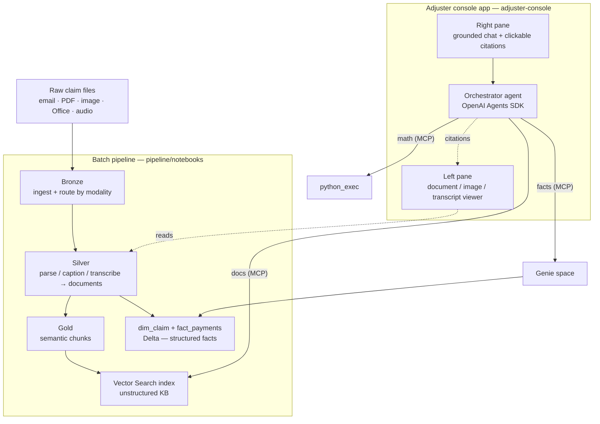

# Insurance Claim Knowledge Base

A reference implementation, on Databricks, of a **multi-modal knowledge base for insurance claims
adjusters** — from raw claim artifacts (emails, PDFs, images, Office docs, audio) to a searchable
knowledge base and a custom **adjuster console** app (document viewer + grounded chat).

Everything here is **synthetic**. It is meant as a blueprint you adapt to your own workspace.

## What's in the repo

| Component | Path | What it is |
|---|---|---|
| **Sample dataset** | [`sample_data/claims/`](sample_data/claims/) | Ready-to-use synthetic test set: 3 internally-consistent auto-collision claims (69 artifacts across modalities) + `ground_truth.csv` and `eval_questions.json`. See its [README](sample_data/claims/README.md). Bring your own claim data for production. |
| **Batch pipeline** | [`pipeline/notebooks/`](pipeline/notebooks/) | Medallion pipeline (Bronze → Silver → Gold → Vector Search) built on Databricks AI Functions. See its [README](pipeline/notebooks/README.md). |
| **Genie space** | [`genie/`](genie/) | Exported config + import script for the Genie space over the structured facts (`dim_claim`, `fact_payments`) that the app routes fact/aggregation questions to. See its [README](genie/README.md). |
| **Adjuster console app** | [`adjuster-console/`](adjuster-console/) | FastAPI + vanilla-JS 2-pane app (doc/image/transcript viewer + grounded chat), deployed to Databricks Apps. |
| **Architecture** | [`docs/claims_kb_architecture.md`](docs/claims_kb_architecture.md) | Diagram + design notes. |
| **Data residency** | [`docs/data_residency.md`](docs/data_residency.md) | Where each asset lives (customer storage vs Databricks-managed) + Vector Search custody options. |
| **Design options & scaling** | [`docs/design_options_and_scaling.md`](docs/design_options_and_scaling.md) | How to expand the default: index structure, scaling for large data, more categories/modalities. |

## Architecture at a glance



- **AI Functions used:** `ai_parse_document`, `ai_classify`, `ai_extract`, `ai_prep_search`, and
  audio transcription via **`ai_transcribe`** (preferred — built-in, speaker diarization) or `ai_query`
  against a Whisper endpoint (the two `03c_*` notebooks are alternatives — run one).
- **Retrieval:** hybrid Vector Search over chunked, metadata-tagged documents; exact aggregation over the
  payment ledger stays in Delta and is answered by a Genie space (semantic search over a ledger is weak).

## Quickstart

**Pipeline** — import `pipeline/notebooks/` into your workspace and run `00_config` → `07` on a
DBR 18.2+ / serverless-env-v3+ cluster (see the [notebooks README](pipeline/notebooks/README.md) for
prerequisites and the AI-function version requirements).

**Genie space** — the app depends on it for structured/fact questions. Create it before deploying the app:
`cd genie && PROFILE=<your-profile> WAREHOUSE_ID=<sql-warehouse-id> ./create_space.sh` — see
[`genie/README.md`](genie/README.md), then put the returned `space_id` into the app config below.

**App** — from `adjuster-console/`:
```bash
uv run quickstart --profile <your-profile>   # auth + .env + MLflow experiment
uv run preflight                             # local smoke test
databricks bundle deploy   --profile <your-profile>
databricks bundle run agent_openai_agents_sdk_multiagent --profile <your-profile>
```
More detail in [`adjuster-console/README.md`](adjuster-console/README.md).

## ⚠️ Replace the reference-workspace IDs with your own

This repo ships with the **workspace-specific identifiers from the reference deployment**. They are
**not secrets** (they're useless without auth to that workspace), but they will **not** work in yours —
swap them for your own values before deploying:

| Where | What to replace |
|---|---|
| `adjuster-console/databricks.yml` | Genie `space_id`, `sql_warehouse` / `warehouse_id`, `experiment_id`, serving-endpoint name, the `fins_genai.claims_multimodal_kb` catalog/schema and Vector Search index |
| `adjuster-console/agent_server/agent.py` | `GENIE_SPACE_ID`, `VS_CATALOG` / `VS_SCHEMA` / `VS_INDEX`, `MODEL` |
| `adjuster-console/agent_server/data_api.py` | `CATALOG` / `SCHEMA` (and the landing-Volume prefix) |
| `pipeline/notebooks/00_config.py` | catalog/schema, volume path, endpoint names |

`uv run quickstart` regenerates `.env` (git-ignored) and the MLflow experiment for your workspace.

## Notes

- No credentials are committed. `.env`, `.venv/`, and `.databricks/` are git-ignored.
- Local dev uses [`uv`](https://docs.astral.sh/uv/). After cloning, run `uv sync` in `adjuster-console/`.
- The `sample_data/claims/` set is synthetic and provided as-is for testing; the generator used to
  create it is kept local-only (not part of this repo).
