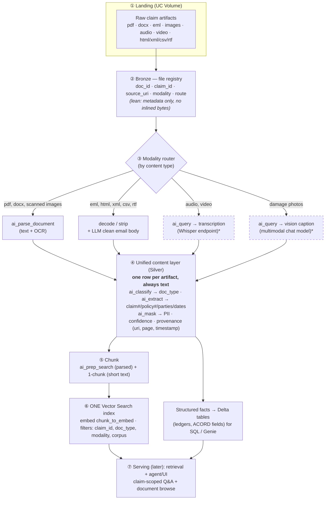

# Multi-Modal Claims Knowledge Base — Default Architecture

**Purpose:** batch-process a claim's mixed artifacts (email, PDF, Word, images, audio, video,
long-tail) into a searchable knowledge base an adjuster can query, plus browse the source documents.

This document describes the **minimum-complexity default** — the simplest design that still handles
multi-modal data correctly. Splits and expansions (multiple indexes, visual search, etc.) are
deliberately *out* of the default and listed at the end as options to add when a business driver
justifies them.

---

## Guiding principle

> **Normalize every modality to one text representation, unify into one index, and separate only
> when the embedding space or a governance boundary forces it.**

A vector index holds a single embedding space. So the design question for each modality is never
"does it need its own index?" but "**what text do I embed, and is it the same space as everything
else?**" Reduce PDFs, scans, emails, speech, and photos to text (OCR, transcript, caption,
extracted fields) and they all live in one index, scoped by metadata filters.

---

## Default architecture

\* Dashed = requires an endpoint not yet stood up (transcription / vision). Everything else runs
today on a serverless SQL warehouse with built-in AI Functions.

---

## Why one index is the default

The adjuster's primary question is **"tell me about claim X"** — which spans doc types and
modalities. A single index with a `claim_id` filter answers it in one call and returns the FNOL,
the medical records, the emails, and the photo captions together. Sharding by topic or doc type
would fragment each claim across indexes and force query fan-out for the most common request.
Topic/doc-type scoping is a **metadata filter**, not a separate index.

## Modality handling in the default

| Modality | Representation for the index | Same text index? |
|---|---|---|
| PDF, DOCX | Parsed text | ✅ |
| Scanned document images (PNG/TIFF) | OCR text | ✅ |
| Email (.eml) | LLM-cleaned body text + headers | ✅ |
| HTML / XML / CSV / RTF | Decoded / stripped text | ✅ |
| Audio / video | Transcript (+ timestamps, diarization) | ✅ (as text) |
| Damage photos | Vision caption / description | ✅ (as text) |
| Structured (XLSX, ACORD fields, ledgers) | **Not embedded** — Delta table for SQL/Genie | ➖ side channel |

## Provenance & governance (built into Silver)

Every chunk keeps `source_uri`, `modality`, `page`/`timestamp`/`bbox`, `confidence`, and
`pii_masked` so answers cite the original artifact, the UI can deep-link (PDF page, audio position,
photo region), low-confidence transcripts/captions can be flagged for review, and PII is masked
*before* indexing.

---

## When to expand beyond the default

Add a **second index** only when one of these is true (otherwise use a filter):

1. **Different embedding space** — image-vector search on photos, multilingual, or domain-specialized embeddings.
2. **Native non-text similarity** — "find claims with visually similar damage."
3. **Governance / access / tenant / data-residency** boundary that row filters can't satisfy.
4. **Update cadence / pipeline isolation** — static reference corpus (SOW, guidelines, policies) vs. streaming claims.
5. **Scale / noisy-neighbor isolation** at large volume.

The most likely first expansions for this use case: a **reference-corpus** split (#4) and an
**image-vector index** for visual damage search (#1/#2) — both driven by customer requirements,
not by the technology. See the companion stakeholder document for the open questions.
